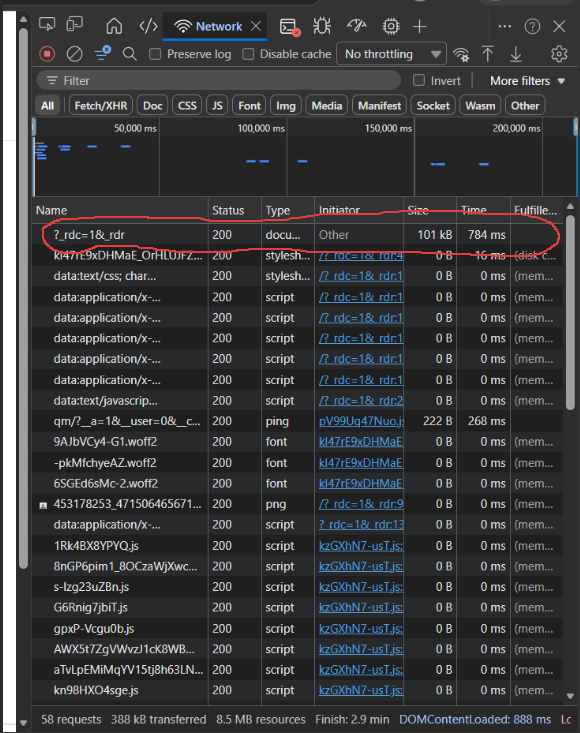
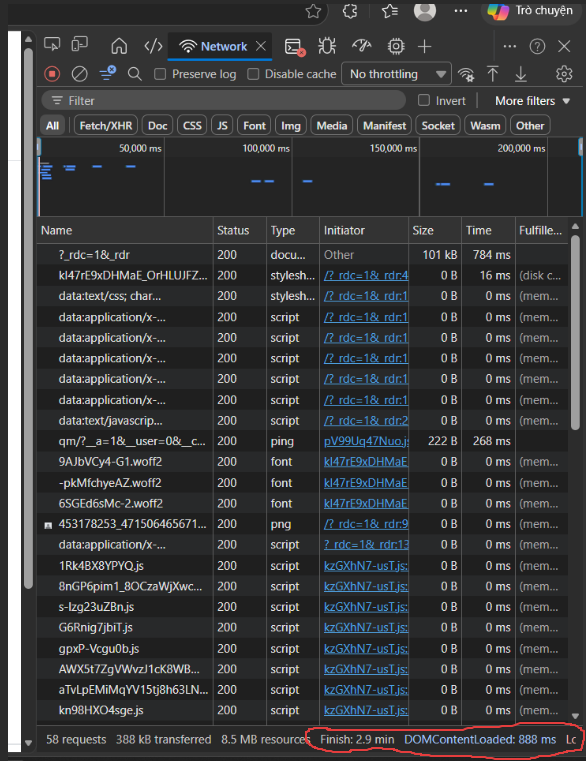
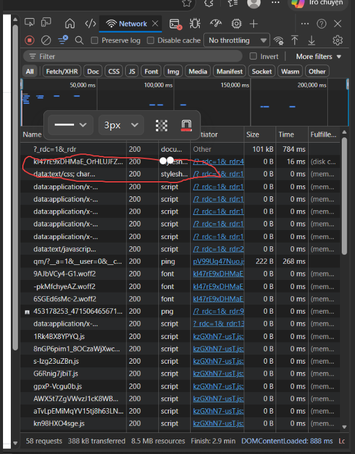

# Câu A1
## 1.
Bước 1: DNS Lookup khi bạn gõ https://shopee.vn vào trình duyệt và nhấn Enter : Trình duyệt gửi câu hỏi đến máy chủ tên miền để đổi shopee.vn thành một địa chỉ IP (ví dụ: 119.31.23.xx). .(đối chiếu đến phần 1.1 của file introduction_html_universe.md mục Bước 1 - Gõ URL & Nhấn Enter (Request): Trình duyệt đóng vai trò Client gửi yêu cầu "Cho tôi Phở bò" (HTTP Request) và hành động Minh mở Chrome, gõ facebook.com và nhấn Enter)
Bước 2: Yêu cầu (Request) của bạn được vận chuyển qua mạng Internet để tìm đến máy chủ.(đối chiếu phần cuộc hành trình 0,3 giây yêu cầu xuất phát từ laptop → đi qua router WiFi nhà trọ → qua nhà mạng VNPT → chạy xuyên cáp quang để đến data center và phần 1.1 Kiến trúc Client-Server — Ví dụ Internet được ví như "anh shipper Grab" làm nhiệm vụ vận chuyển request và response)
Bước 3: Máy chủ (Server) của Shopee tiếp nhận và xử lý yêu cầu: (Đối chiếu: Mục 1.1 Kiến trúc Client-Server Server đóng vai trò là "Nhà hàng / Bếp nấu phở" đang tiến hành chuẩn bị món ăn )
Bước 4: Máy chủ Shopee gửi trả kết quả (HTTP Response) về cho trình duyệt của bạn (Đối chiếu Mục 1.1 Kiến trúc Client-Server , quá trình Server gửi trả lại kết quả giống như việc nhà hàng mang món ra và nói "Phở đây ạ" và  dồng thời đối chiếu Mục 1.2 HTTP — Ví dụ Server trả lời bằng HTTP Response Code là 200 OK (Thành công) và gửi kèm các file dữ liệu HTML, CSS, JS qua con đường cáp quang ngược lại)
Bước 5: Trình duyệt nhận file và vẽ giao diện Shopee lên màn hình (Browser Rendering) (Đối chiếu: Mục 1.3 Browser Rendering ,trình duyệt hoạt động giống như một "kiến trúc sư xây nhà", nó tiến hành 4 công đoạn: Parse HTML (Đọc bản vẽ kiến trúc), Parse CSS (Đọc bản thiết kế nội thất), Execute JS (Lắp hệ thống điện, nước) và Paint & Render (Hoàn thiện, giao nhà cho chủ / hiện lên màn hình)

## 2.
Tab Network trong DevTools cho thấy toàn bộ lịch sử giao tiếp mạng (network requests) giữa trình duyệt của bạn và máy chủ. Nó liệt kê mọi tài nguyên được tải về (HTML, CSS, JS, ảnh, gọi API...), dung lượng, trạng thái thành công/thất bại, và thời gian tải của từng thành phần.
Status Code của request đầu tiên .
Tổng thời gian load trang. 
Một request trả về file CSS 

# Câu A2
1. Lỗi dùng 
 cho phần đầu trang: Dòng 
 không mang ý nghĩa ngữ nghĩa. Cần dùng thẻ <header> để định nghĩa phần chứa logo và menu chính.
2. Lỗi dùng 
 cho thanh điều hướng: Dòng 
 khiến Google không nhận diện được đây là các link chuyển trang. Cần bọc chúng trong thẻ <nav>
3. Lỗi dùng 
 cho nội dung chính: Dòng 
 nên được thay bằng thẻ <main> để báo cho công cụ tìm kiếm biết đây là trọng tâm của trang web
4. Lỗi dùng 
 cho phần chân trang: Dòng 
 cần được đổi thành <footer> để xác định rõ khu vực chứa thông tin bản quyền
5. Lỗi thiếu ngữ nghĩa cho Text và Media: Tiêu đề sản phẩm dùng 
 thay vì các thẻ heading (<h2>, <h3>). Thẻ  thiếu thuộc tính alt để giải thích nội dung ảnh cho SEO

# Câu A3
[------------------------------------------------]
| Hộp 1 (Chiếm toàn bộ chiều ngang)              |
[------------------------------------------------]
[TextA][Text B] 
[------------------------------------------------]
| Hộp 2 (Chiếm toàn bộ chiều ngang)              |
[------------------------------------------------]
[Text C][Text D] 
[------------------------------------------------]
| Hộp 3 (Chiếm toàn bộ chiều ngang)              |
[------------------------------------------------]

 là thẻ Block (Khối): Thẻ Block luôn bắt đầu ở một dòng mới và vươn dài ra chiếm toàn bộ chiều ngang có thể. Do đó, 
Hộp 1
 chiếm trọn dòng đầu tiên.

 là thẻ Inline (Nội tuyến): Thẻ Inline  chiếm vừa đủ diện tích nội dung của nó và không tự động xuống dòng. Vì vậy, Text A và Text B sẽ nằm xếp hàng ngang cạnh nhau ở dòng tiếp theo.

Hộp 2
 (Block): Trình duyệt thấy một thẻ Block mới, nó lập tức ngắt dòng những thẻ span ở trên và đẩy "Hộp 2" xuống một dòng riêng biệt, chiếm trọn cả dòng.

Text C và <strong>Text D</strong> (Đều là Inline): Bị đẩy xuống dưới Hộp 2, hai phần tử này lại tiếp tục xếp hàng ngang cạnh nhau. Đặc biệt, thẻ <strong> ngoài tính chất là Inline, nó còn mang ngữ nghĩa nhấn mạnh, nên trình duyệt sẽ mặc định hiển thị chữ "Text D" in đậm.

Hộp 3
 (Block): Lại tiếp tục nguyên lý cũ, thẻ 
  ép xuống một dòng mới để đứng một mình và chiếm trọn không gian chiều ngang.

# Câu A4
<thead>	:Table Header:Chứa các tiêu đề của cột (thường dùng thẻ <th>). Giúp người dùng biết cột đó đang nói về cái gì (ví dụ: Tên sản phẩm, Giá, Số lượng).
<tbody>	:Table Body:Chứa nội dung chính của bảng (dữ liệu thực tế). Đây là phần "thân" nơi các dòng dữ liệu (<tr>) và ô dữ liệu (<td>) xuất hiện nhiều nhất.
<tfoot>	:Table Footer:Chứa phần tổng kết hoặc chú thích cho bảng. Ví dụ: Dòng "Tổng cộng" ở cuối hóa đơn Shopee hoặc dòng "Điểm trung bình" ở cuối bảng điểm.
(đối chiếu phần bảng trong chương 5)
⚠️ Quy tắc: <table> chỉ dùng cho dữ liệu dạng bảng (danh sách, so sánh, thống kê). KHÔNG dùng cho layout trang web!
Lý do:
Lý do 1: Sai lệch ngữ nghĩa (Semantic) và SEO
Như bài học ở Chương 04, Google cực kỳ coi trọng tính Semantic. Thẻ <table> được sinh ra để hiển thị dữ liệu bảng biểu . Nếu bạn dùng nó để làm layout (bọc toàn bộ trang web vào table), Google sẽ hiểu nhầm trang web của bạn là một cái bảng khổng lồ chứ không phải là một trang tin tức hay bán hàng. Điều này làm trang web của bạn biến mất khỏi các trang đầu của kết quả tìm kiếm
Lý do 2:Tốc độ tải trang và khả năng truy cập (Accessibility)
Hiệu năng: Trình duyệt phải nhận được toàn bộ dữ liệu của bảng thì mới có thể tính toán và hiển thị chính xác layout. Điều này làm trang web trông có vẻ chậm hơn.
("Có chứ! <table>," Minh trả lời. "Nhưng anh Hùng dặn: chỉ dùng table cho DATA tabular. Dùng table để layout trang = sai. Ngày xưa người ta làm thế, giờ dùng CSS Grid/Flexbox.)

# Câu C1
<header> <nav> <ul> <!--Chọn thẻ  header vì đây là phần đầu trang chứa logo và điều hướng tổng-->
<!-- Chọn thẻ nav vì đây là khu vực chứa các liên kết điều hướng chính -->
            <li><a href="/">Logo</a></li>
            <li><a href="/products">Danh mục</a></li>
        </ul>
    </nav>
</header>

<main> <nav aria-label="breadcrumb"> <ol> <li><a href="/">Trang chủ</a></li> 
<!-- Chọn thẻ main
 vì đây là vùng chứa nội dung cốt lõi và duy nhất của trang này. -->
 <!-- Chọn thẻ nav aria-label="breadcrumb này vì đây là một cụm điều hướng phụ (đường dẫn liên kết) -->
            <li><a href="/dien-thoai">Điện thoại</a></li>
            <li>iPhone 16</li>
    </ol> <!--Chọn thẻ ol vì Breadcrumb có tính thứ tự cấp bậc (Trang chủ > Điện thoại)
    </nav>

    <article> <section class="gallery"> <figure> 
          <!--<article> — Chọn thẻ này vì thông tin về một sản phẩm cụ thể là một nội dung độc lập, trọn vẹn.>
          <!--section class="gallery"> — Chọn thẻ này vì đây là một phân đoạn nội dung riêng biệt dành cho ảnh>
            </figure> <!--Chọn thẻ này vì đây là vùng chứa media (ảnh) có tính minh họa>
        </section>

        <section class="info"> <h1>iPhone 16</h1> <!--<section class="info"> — Chọn thẻ này vì đây là phân đoạn chứa các thông tin giới thiệu sản phẩm.>,<!--Chọn thẻ này vì tên sản phẩm là tiêu đề quan trọng nhất trên trang>
            
<strong>25.990.000đ</strong>

            
        </section>

        <section class="specs"> <table> <tbody> <tr> <!--<section class="specs"> — Chọn thẻ này vì đây là phân đoạn chứa thông số cấu hình, thẻ table chứa dữ liệu bảng>
                        <th>Màn hình</th>
                        <td>6.1 inch</td>
                    </tr>
                    ...
                </tbody> <!--<tbody> — Chọn thẻ này vì đây là phần thân chứa dữ liệu của bảng thông số>
            </table>
        </section>

        <section class="reviews"> <article> <header> <h3>Nguyễn Văn A</h3> <!--Chọn thẻ này vì đây là phân đoạn dành cho đánh giá của khách hàng,thẻ article vì mỗi bình luận là 1 nội dung độc lập do người dùng tạo ra >
                    ...
                </header> <!--<header> Chọn thẻ này vì đây là phần đầu của bình luận chứa thông tin người đăng>
                
Sản phẩm rất tốt!

            </article>
        </section>

    </article>

    <aside> <ul> <!--<aside>  Chọn thẻ này vì đây là nội dung phụ trợ, liên quan gián tiếp (sản phẩm tương tự)>
            <li><a href="#">iPhone 15</a></li>
            ...
        </ul>
    </aside>

</main>

<footer> 
&copy; 2026 ShopTLU
 <!--<footer> Chọn thẻ này vì đây là khu vực chân trang chứa thông tin bản quyền.>
</footer>

# Câu C2
Chào đồng nghiệp, mình hiểu quan điểm của bạn vì 
 + class thực sự giúp chúng ta kiểm soát giao diện rất nhanh bằng CSS. Tuy nhiên, nếu lạm dụng "nồi súp div" (div soup) mà bỏ qua Semantic HTML, chúng ta đang trực tiếp gây hại cho sản phẩm ở hai khía cạnh kỹ thuật cốt yếu:

1. SEO (Tối ưu hóa công cụ tìm kiếm): Google không "nhìn" trang web bằng mắt như chúng ta, nó đọc bằng thuật toán. Khi bạn dùng thẻ <article> cho một sản phẩm hay <header> cho đầu trang, bạn đang cung cấp các từ khóa cấu trúc giúp bot Google hiểu đâu là nội dung chính cần ưu tiên hiển thị trên kết quả tìm kiếm. Ngược lại, hàng chục thẻ 
 vô nghĩa sẽ khiến bot bị "bối rối", dẫn đến việc trang web của chúng ta bị tụt hạng so với đối thủ dùng Semantic chuẩn.

2. Accessibility (Khả năng tiếp cận): Đây là lý do nhân văn và kỹ thuật quan trọng. Những người khiếm thị sử dụng phần mềm đọc màn hình (Screen Reader) để lướt web. Phần mềm này dựa vào các thẻ như <nav>, <main>, <button> để giúp họ nhảy nhanh đến mục tiêu. Nếu dùng toàn bộ là 
, họ sẽ phải nghe máy đọc từng dòng một từ đầu đến cuối trang, cực kỳ khó khăn.

Ví dụ cụ thể: Hãy nhìn vào thanh điều hướng. Nếu dùng <nav>, trình duyệt và các công cụ hỗ trợ sẽ tự động hiểu đây là khu vực liên kết quan trọng nhất. Thậm chí trên trình duyệt di động, đôi khi thẻ <nav> còn được tối ưu hóa để hiển thị menu mượt mà hơn mà không cần bạn phải viết thêm quá nhiều code hỗ trợ.

Khi nào dùng 
 vẫn phù hợp?
Tất nhiên, mình không bài trừ 
. Nó vẫn là "vũ khí" tốt nhất khi chúng ta cần một cái hộp hoàn toàn vô nghĩa về mặt nội dung, chỉ phục vụ mục đích trang trí hoặc bố cục (styling). 
Ví dụ: Bạn cần một khối bao quanh để căn giữa một nhóm phần tử bằng Flexbox, hoặc tạo một đường kẻ trang trí giữa các đoạn văn — đó chính là lúc thẻ 
 được dùng tốt nhất vì nó không làm sai lệch ý nghĩa của trang web

# Bài b3
Lỗi 1: Dòng 1 — Khai báo <!DOCTYPE> thiếu html — Cách sửa: Đổi thành <!DOCTYPE html>.

Lỗi 2: Dòng 2 — Thẻ <title> chưa được đóng — Cách sửa: Thêm thẻ đóng </title>.

Lỗi 3: Dòng 3 — Định dạng charset viết sai (utf8) — Cách sửa: Đổi thành UTF-8.

Lỗi 4: Dòng 5 — Thẻ <h1> đóng sai (dùng thẻ mở làm thẻ đóng) — Cách sửa: Đổi <h1> ở cuối thành </h1>.

Lỗi 5: Dòng 9 — Thẻ <a> đóng sai (<a>) — Cách sửa: Đổi thành </a>.

Lỗi 6: Dòng 17 — Thẻ  thiếu dấu ngoặc kép và thuộc tính alt — Cách sửa: Thêm src="iphone.jpg" và alt="iPhone 16 Pro".

Lỗi 7: Dòng 19 — Lỗi lồng thẻ (thẻ <b> đóng sau thẻ 
) — Cách sửa: Đóng theo thứ tự <b>...</b>
.

Lỗi 8: Dòng 24-27 — Tiêu đề bảng dùng thẻ <td> — Cách sửa: Đổi thành <th> để đúng ý nghĩa tiêu đề cột.

Lỗi 9: Dòng 36 — Sử dụng hai thẻ <main> trên một trang — Cách sửa: Một trang chỉ được có duy nhất một thẻ <main>.

Lỗi 10: Dòng 36 — Sidebar đặt trong <main> là sai mục đích — Cách sửa: Đổi thẻ <main> thứ hai thành <aside>.

Lỗi 11: Dòng 41 — Thẻ 
 trong footer chưa được đóng — Cách sửa: Thêm thẻ 
 ở cuối.